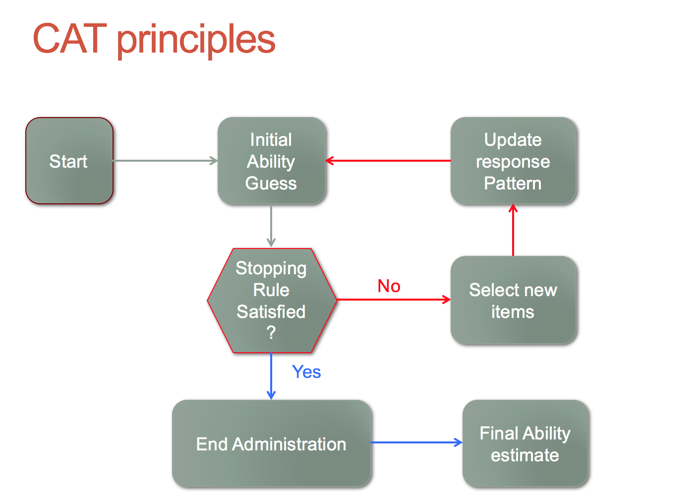

```{r setup, include=FALSE}
knitr::opts_chunk$set(echo = TRUE)
```

# Still Building

The basic idea is to give you a general idea of how to run a Computer Adaptive Test. 

We will utilise `catR` package. 

It works well with concerto. 

Developed by awesome people. 


## Concept 

Let's use student as participants to put things in context. 

The idea of a CAT test is to distribute questions based on the ability of the student. This means that unfortunately, student won't be able to see the next item until they have completed the current item. Hence, it makes it difficult for CAT to be used in pencil and paper tests. 

THe logic goes like that. 

- If the student gets the current item right, then the next item becomes more difficult. But if the student gets it wrong, then the next item becomes easier. Once the test system gets an accurate idea of the student ability. The test stops. Usually, implementing such a system will make the test shorter than a standardised test. 




<script>
  (function(i,s,o,g,r,a,m){i['GoogleAnalyticsObject']=r;i[r]=i[r]||function(){
  (i[r].q=i[r].q||[]).push(arguments)},i[r].l=1*new Date();a=s.createElement(o),
  m=s.getElementsByTagName(o)[0];a.async=1;a.src=g;m.parentNode.insertBefore(a,m)
  })(window,document,'script','https://www.google-analytics.com/analytics.js','ga');

  ga('create', 'UA-98916204-1', 'auto');
  ga('send', 'pageview');

</script>