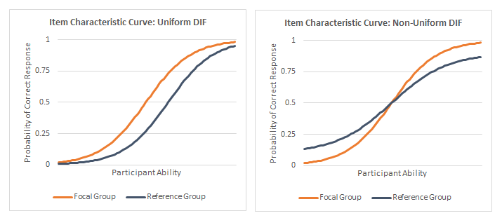

```{r setup, include=FALSE}
knitr::opts_chunk$set(echo = TRUE)
```

```{r packages, warning=FALSE, message=FALSE, results='hide', echo=FALSE}
library(eRm)
library(reshape)
library(dplyr)
library(ggplot2)
library(gtable)
library(gridExtra)
library(grid)
library(mirt)
library(tidyr)
library(pander)
```

This page provides a broad overview of IRT. In time, I will create more specific content that talks about each area in greater detail. Please email me if you notice any problems. I can be reached at bsl28@cam.ac.uk

<br/>

## **Assumptions of IRT**

In short, there are 4 assumptions of IRT. 

1. Monotonicity (Shape of curve)

2. Unidimensionality
    
3. Item invariance
    
4. Local independence

<br/>

### *Monotonicity*

Monotonicity is best displayed on a graph as if the curve look like the following below. This curve are called the item characteristics curve (ICC), which is assumed to reflect the true relationship between the trait and the responses to the item. For example, in an educational setting, what you see is that as the ability level increases, the probability of getting the item correct increases monotonicially.  Within a health setting, that would mean that as the ability level incerases, the participant is more likely to endorse a higher response option for that item.  

```{r mono, echo=FALSE}
library(mirt)
dat <- expand.table(LSAT7)
mod <- mirt(dat, 1,itemtype="Rasch", verbose=FALSE)

# Extract all items 
# Compute the probability trace lines
# Put into a list
traceline <- NULL
for(i in 1:length(dat)){
extr.2 <- extract.item(mod, i)
Theta <- matrix(seq(-4,4, by = .1))
traceline[[i]] <- probtrace(extr.2, Theta)
}

# rename list
names(traceline) <- paste('item',1:length(traceline))

# rbind traceline
traceline.df <- do.call(rbind, traceline)

# create item names length based on length of theta provided
item <- rep(names(traceline),each=length(Theta))

# put them all together into a dataframe
l.format <- cbind.data.frame(Theta, item, traceline.df)

# Selecting item
items <- c("item 1", "item 2", "item 3", "item 4")
l.format <-l.format[l.format$item == items[3],]


# plot chart
ggplot(l.format, aes(Theta, P.1, colour = item)) + 
  geom_line() + 
  ggtitle('ICC') + 
  xlab(expression(theta)) + 
  ylab(expression(P(theta))) + 
  theme_bw() + 
  theme(text = element_text(size=16),
        axis.text.x=element_text(colour="black"),
        axis.text.y=element_text(colour="black"),
        legend.title=element_blank())
```

There are a few ways to test this. One way is to use mokken analysis. The `mokken` package can be used to test for item monotonicity. 

<br/>

### *Unidimensionality*

In the context of IRT, undimensionality is assumed. That is, only one latent trait is measured by the set of items in the test. For example, all the items in the CES-D scale is a measure of the depression symptoms and nothing else. That is what it means to be unidimensional. You can use factor analysis for example to evaluate the dimensionality of the test. You can think of it graphically like the image below. All the items are meant to be measuring only a single latent trait. 


There is something called multidimensional item response theory, where a scale could measure more than a single trait. Reckase (2009) is a fantastic book on the topic of MIRT. But that is something for another day.

<br/>

### *Item invariance*

The assumption of invariance is best understood as the characteristics of the item parameters and latent trait being independent of the sample characteristics within a population. That means, for an item such as "I do not cry often", the item parameters estimated by an IRT model would not change even if the characteristics of the patient, such as age or gender, changes. Under IRT, the ability of a person under measure *does not change due to sample characteristics*. Differential Item Functioning (DIF) analysis is often used to evaluate if this assumption if violated.  

Here is how two types of DIF looks like: 

<div style="width:500px; height=400px">

</div>

Ideally, you want both curves to be together rather than separated in order for the assumption of item invariance to hold. 

<br/>

### *Local independence*

Under the assumption of local independence, the participants responses are not statistically related to each other, before and even after the latent trait is taken into consideration. There are two situations where local independence may appear: (1) where negatively worded items are included in the scale. (2) the responses of one item influences the way participant responses to another item. Some solutions to resolve these problems are:

+ Simplify the wording of items

+ Decrease the number of items

+ Limit the response options. 

<br/>

## **Properties of IRT**

Several item properties are necessary to know. Namely, the properties are that estimated based on IRT models. 

+ Discrimination($\alpha{_i}$) 

+ Difficulty($b_i$)

+ Guessing($c_i$)

+ Inattention($d_i$) parameter.  

where, i = items. 

<br/>

### *Discrimination parameter ($\alpha{_i}$)*

The discrimiation parameter is aka the  $\alpha{_i}$ parameter. It is used to determine how well the items discriminate against different levels of the latent trait. In this case, ranging from -4 to 4. The $\alpha{_i}$ parameter other name is the slope parameter. Steeper slopes at particular level of the traits indicate that it is more discriminative than levels of the traits with gentler slopes. 

So if you just look at the green item, it is most discriminative between -2 to 0, and it is least discriminative between -4 to -2 and 0 to 4. The most discriminative point is always at the centre of the curve.

In theory, the values for the $\alpha{_i}$ ranges from $-\infty$ to $+\infty$. Negative values of the $\alpha{_i}$ are possible but considered problematic as it would mean that items with increasing levels of ability are less likely to endore more severe response options. This could happen when the item poorly discriminates between levels of the ability (illogical relationship) or there was some sort of coding error. 

```{r alpha, echo=FALSE}
library(mirt)
dat <- expand.table(LSAT7)
mod <- mirt(dat, 1, verbose=FALSE)

# Extract all items 
# Compute the probability trace lines
# Put into a list
traceline <- NULL
for(i in 1:length(dat)){
extr.2 <- extract.item(mod, i)
Theta <- matrix(seq(-4,4, by = .1))
traceline[[i]] <- probtrace(extr.2, Theta)
}

# rename list
names(traceline) <- paste('item',1:length(traceline))

# rbind traceline
traceline.df <- do.call(rbind, traceline)

# create item names length based on length of theta provided
item <- rep(names(traceline),each=length(Theta))

# put them all together into a dataframe
l.format <- cbind.data.frame(Theta, item, traceline.df)

l.format$item<-as.factor(l.format$item)
aux<-l.format %>%
  group_by(item) %>%
  slice(which.min(abs(P.1-0.5))) # We are only using the P.1 column (dichotomous)

aux<-aux[order(aux$Theta),]
ord<-as.integer(aux$item)
l.format$item = factor(l.format$item,levels(l.format$item)[ord])

# plot chart
ggplot(l.format, aes(Theta, P.1, colour = item)) + 
  geom_line() + 
  ggtitle('ICC') + 
  xlab(expression(theta)) + 
  ylab(expression(P(theta))) + 
   theme_bw() + 
  theme(text = element_text(size=16),
        axis.text.x=element_text(colour="black"),
        axis.text.y=element_text(colour="black"),
        legend.position="none")
```

From the plot above, we can see that some items are more discriminating than others. For example, it is clear that the green item is the most discriminating item because of the steepest slope it has compared to the other items. Arguably, either the red item or the purple item would have the gentlest slope. This has to be confirmed emprically of course. 

<br/>

### *Difficulty parameter ($b_i$)*

#### *Dichotomous response options*

The difficulty parameter is used to describe how difficulty an item is to achieve a 0.5 probability of correct response at a given ability. Therefore, if the 50% chance of correctly answering an item is at the right side of the plot, then it means that a higher level of ability is needed to achieve that goal. Here you can see that item 5 is easier than item 4 because it requires a lower level of theta ability to get a 50% chance of answering an item correctly. 

```{r diffOne, echo=FALSE}
library(mirt)
dat <- expand.table(LSAT7)
mod <- mirt(dat, 1, itemtype='Rasch',verbose=FALSE)

# Extract all items 
# Compute the probability trace lines
# Put into a list
traceline <- NULL
for(i in 1:length(dat)){
extr.2 <- extract.item(mod, i)
Theta <- matrix(seq(-4,4, by = .1))
traceline[[i]] <- probtrace(extr.2, Theta)
}

# rename list
names(traceline) <- paste('item',1:length(traceline))

# rbind traceline
traceline.df <- do.call(rbind, traceline)

# create item names length based on length of theta provided
item <- rep(names(traceline),each=length(Theta))

# put them all together into a dataframe
l.format <- cbind.data.frame(Theta, item, traceline.df)


l.format$item<-as.factor(l.format$item)
aux<-l.format %>%
  group_by(item) %>%
  slice(which.min(abs(P.1-0.5))) # We are only using the P.1 column (dichotomous)

aux<-aux[order(aux$Theta),]
ord<-as.integer(aux$item)
l.format$item = factor(l.format$item,levels(l.format$item)[ord])

# plot chart
ggplot(l.format, aes(Theta, P.1, colour = item)) + 
  geom_line() + 
  ggtitle('ICC') + 
  xlab(expression(theta)) + 
  ylab(expression(P(theta))) + 
  geom_hline(aes(yintercept = 0.5)) + theme_bw() + 
  theme(text = element_text(size=16),
        axis.text.x=element_text(colour="black"),
        axis.text.y=element_text(colour="black"),
        legend.title=element_blank())

```

#### *Polytomous response options*

In the health setting, the location parameter is used instead of difficulty. Because there are far more response options in a health questionnaire (e.g. 4 response options), the categorical response curves for an item are used instead. That is, a patient with a higher level of ability, say depression, would be more likely to have a 50% probability of endorsing the most severse response options than a patient with a lower level of ability.

The *categorical response curve* shows the probability of each response against the theta value that measures the location of the latent trait. In other words, they represent the probability that an individual responds in a particularly category given a trait level. Just a note that, at any fixed value of ability, the sum of the response probabilities is equal to 1.0. 

The points where the curves cut each other represents the transition moving from one category to the next. So patients with a theta value of less than -3 will most likely select category 1. Those between greater than -3 and -1.8 will select category 2, so on and so forth. For polytomous items (more than 2 response options), it is very complex to put them all the item curves in a single plot. So each plot represents an item. 

<br/>

```{r crc, echo=FALSE}
data(Science)
mod <- mirt(Science,1, itemtype='gpcm', verbose=FALSE)

# Extract all items 
# Compute the probability trace lines
# Put into a list
traceline <- NULL
for(i in 1:length(Science)){
  extr.2 <- extract.item(mod, i)
  Theta <- matrix(seq(-6,6, by = .1))
  traceline[[i]] <- probtrace(extr.2, Theta)
}

names(traceline) <- paste('item',1:length(traceline))

# rbind traceline
traceline.df <- do.call(rbind, traceline)

# create item names length based on length of theta provided
item <- rep(names(traceline),each=length(Theta))

# put them all together into a dataframe
l.format <- cbind.data.frame(Theta, item, traceline.df)

# wide to long format. 
longer.format <- gather(l.format,categorials,measurement,P.1:P.4)
longer.format$item<-as.factor(longer.format$item)

# Selecting items
items <- c("item 1", "item 2", "item 3", "item 4")

# select item to display CRC and OCC
item <- 4
item.format <-longer.format[longer.format$item == items[item],]

# plot chart
plot1 <- ggplot(item.format, aes(Theta, measurement, colour = categorials, fill=categorials)) + 
  geom_line() + 
  ggtitle('Categorical Response Curve for Item Benefit') + 
  xlab(expression(theta)) + 
  ylab(expression(P(theta))) + 
  theme_bw() + 
  theme(text = element_text(size=16),
        axis.text.x=element_text(colour="black"),
        axis.text.y=element_text(colour="black"),
        legend.position="none") + 
  geom_text(aes(x = -4, y = 0.75, label = "C1", color="P.1")) + 
  geom_text(aes(x = -2, y = 0.58, label = "C2", color="P.2")) + 
  geom_text(aes(x = 0.2, y = 0.65, label = "C3", color="P.3")) + 
  geom_text(aes(x = 2.5, y = 0.75, label = "C4", color="P.4")) 


# item coefficient
cfs <- coef(mod, IRTpars = TRUE, simplify=TRUE)$items

# 2pl
twopl <- function(a, b, theta){
  1 / (1 + exp(-(a * (theta - b))))}

# theta 
theta <- seq(-6,6,.1)

# create Operational characteristic curve
lst <- list()
for(i in 1:3) lst[[i]] <- twopl(a=cfs[item,1], b=cfs[item,i+1], theta=theta)

dat <- data.frame(theta, as.data.frame(lst))
names(dat) <- c('theta', 'b1', 'b2', 'b3')

# wide to long format. 
longer.format <- gather(dat,categorials,measurement,b1:b3)

# Item Parameter Estimates table
itemPar <- cfs

# plot chart
plot2 <- ggplot(longer.format, aes(theta, measurement, colour=categorials)) + 
  geom_line() + 
  ggtitle(paste('Operational Characteristic Curve for Item', rownames(cfs)[item])) + 
  xlab(expression(theta)) + 
  ylab(expression(P(theta))) + 
  geom_vline(aes(xintercept = cfs[item,2]), color='red') +
  geom_vline(aes(xintercept = cfs[item,3]), color="green") +
  geom_vline(aes(xintercept = cfs[item,4]), color='blue') +
  geom_hline(aes(yintercept = 0.5)) + theme_bw() + 
  theme(text = element_text(size=16),
        axis.text.x=element_text(colour="black"),
        axis.text.y=element_text(colour="black"),
        legend.title=element_blank(),
         legend.position="hide") +
  geom_text(aes(x = -3.3, y = 0.55, label = "b1", color="b1")) + 
  geom_text(aes(x = -1.2, y = 0.55, label = "b2", color="b2")) + 
  geom_text(aes(x = 1.3, y = 0.55, label = "b3", color="b3")) 
  

plot1


```

The point of between category threshold parameters represent the point ($b_{ij}$) along the latent trait scale at which the participants have a 0.5 probability of responding in or above a category threshold. The value for that point is known as the difficulty parameter between the two categories. So if you have 4 response option, you have 3 categories (*k - 1, where k is number of categories*). 

<br/>

```{r poly diff, echo=FALSE}
plot2
```

<br/>

### *Guessing parameter ($c_i$)*

The guessing parameter is more widely used in the educational setting where guessing the correct answer for an item may be attempted by the test taker. So the IRT model has to account for the guessing or the pseudo-chance-level paramter ($c_i$). The plot below shows that we set a global guessing parameter to be 0.2 for all items. For example, the guessing parameter is set to 0.2 because there are 5 response options, so a 0.2 chance of randomly guessing the item correctly. It is possible to get the IRT model to get the guessing parameter as well. 

This parameter is not so widely used in the health area or personality assessment since there are usually no right or wrong answers. 


```{r guessing, echo=FALSE}
data(SAT12)

# Anything that is 1 becomes 1 in the first column
# Anything that is 4 becomes 1 in the second column. etc
data <- key2binary(SAT12,
                   key = c(1,4,5,2,3,1,
                           2,1,3,1,2,4,
                           2,1,5,3,4,4,
                           1,4,3,3,4,1,
                           3,5,1,3,1,5,
                           4,5))

#with fixed guessing parameters
mod <- mirt(data, 1, guess = .2, verbose=FALSE)
data(SAT12)

# Extract all items 
# Compute the probability trace lines
# Put into a list
traceline <- NULL
for(i in 1:length(dat)){
  extr.2 <- extract.item(mod, i)
  Theta <- matrix(seq(-4,4, by = .1))
  traceline[[i]] <- probtrace(extr.2, Theta)
}

# rename list
names(traceline) <- paste('item',1:length(traceline))

# rbind traceline
traceline.df <- do.call(rbind, traceline)

# create item names length based on length of theta provided
item <- rep(names(traceline),each=length(Theta))

# put them all together into a dataframe
l.format <- cbind.data.frame(Theta, item, traceline.df)

items <- c("item 1", "item 2", "item 3", "item 4")
l.format <-l.format[l.format$item == items[2],]

# plot chart
ggplot(l.format, aes(Theta, P.1)) + 
  geom_line(colour="red") + 
  ggtitle('ICC') + 
  xlab(expression(theta)) + 
  ylab(expression(P(theta))) + 
  ylim(c(0,1))+
  theme_bw() + 
  theme(text = element_text(size=16),
        axis.text.x=element_text(colour="black"),
        axis.text.y=element_text(colour="black"),
        legend.title=element_blank())
```


<br/>

### *Inattention parameter ($d_i$)*

The inattention parameter is included when we want to account for situations where someone may have answered incorrectly unintentionally. This could be reasons such as fatigue, accidently clicking on the wrong response option etc. 

Again, not so widely use in psychological assessment. 

```{r inattention, echo=FALSE, warning=FALSE, message=FALSE}
data(SAT12)

# Anything that is 1 becomes 1 in the first column
# Anything that is 4 becomes 1 in the second column. etc
data <- key2binary(SAT12,
                   key = c(1,4,5,2,3,1,
                           2,1,3,1,2,4,
                           2,1,5,3,4,4,
                           1,4,3,3,4,1,
                           3,5,1,3,1,5,
                           4,5))

#with fixed guessing parameters
mod <- mirt(data, 1, upper=.8, verbose=FALSE)
data(SAT12)

# Extract all items 
# Compute the probability trace lines
# Put into a list
traceline <- NULL
for(i in 1:length(dat)){
  extr.2 <- extract.item(mod, i)
  Theta <- matrix(seq(-4,4, by = .1))
  traceline[[i]] <- probtrace(extr.2, Theta)
}

# rename list
names(traceline) <- paste('item',1:length(traceline))

# rbind traceline
traceline.df <- do.call(rbind, traceline)

# create item names length based on length of theta provided
item <- rep(names(traceline),each=length(Theta))

# put them all together into a dataframe
l.format <- cbind.data.frame(Theta, item, traceline.df)

items <- c("item 1", "item 2", "item 3", "item 4")
l.format <-l.format[l.format$item == items[2],]

# plot chart
ggplot(l.format, aes(Theta, P.1)) + 
  geom_line(colour="blue") + 
  ggtitle('ICC') + 
  xlab(expression(theta)) + 
  ylab(expression(P(theta))) + 
  ylim(c(0,1))+
  theme_bw() + 
  theme(text = element_text(size=16),
        axis.text.x=element_text(colour="black"),
        axis.text.y=element_text(colour="black"),
        legend.title=element_blank())
```
<br/>

### *Scaling factor: D constant*

The scaling factor is a constant with the value of 1.7 that is used to bring the estimates of the logistic function and the mornal ogive function in an IRT model to be similar. The logistic function was introduced by Brinbaum t make it easier to calculate item parameters and the probability of theta without too much mathematical complications. The normal ogive function on the other hand, is based on the cumulative normal distribution. Nowadays, the logistic function based IRT model is more widely used than the normal ogive function based IRT model. 

<br/>

## **IRT Models** 

There are many different IRT models. I will just list the popular ones here for now. I also included the LLTM(s) because I have used them previously. IRT models that include reaction time is not within the scope for now. 

#### *Dichotomous Model*

+ Rasch model

+ 1 parameter logistic model

+ 2 parameter logistic model 

+ 3 parameter logistic model 

+ 4 parameter logistic model 

+ Unfolding model (Ideal point models)

#### *Polytomous Model*

+ Polytmous Rasch Model

+ Partial Credit Model 

+ Generalised Partial Credit Model 

+ Graded Response Model 

#### *Specialised Model*

+ Linear Logistic Test Model (LLTM)

+ LLTM + error

+ Random weights LLTM

<br/>

## **General Information**

### *$\alpha{}$ par to std loading*

To convert a discrimination parameter into a value that is similar to a standardised factor loading.

The formula is :

<br/>
<center>$\large{f = \frac{\alpha}{\sqrt{(1+\alpha{^2})}}}$</center><br/>

Bear in mind that $\alpha = \frac{\alpha}{1.702}$ because you are scaling the logistic metric to a normal ogive.

For example, if $\alpha = 0.5$ which is $0.5/1.702 = 0.293772$, <br/>

Then the standardised loading is:

<br/>
<center>$\large{f = \frac{0.293772}{\sqrt{(1+0.293772^2)}}}$ </center> <br/>

The result is 0.2818 $\approx$ 0.3.

<br/>

#### Citations

+ Chalmers, R. P. (2012). mirt: A multidimensional item response theory package for the R environment. Journal of Statistical Software, 48(6), 1-29.

+ Reckase, M. (2009). Multidimensional item response theory (Vol. 150). New York, NY: Springer.

+ Wirth, R. J., & Edwards, M. C. (2007). Item factor analysis: current approaches and future directions. Psychological methods, 12(1), 58.

+ Yang, F. M. (2014). Item response theory for measurement validity. Shanghai archives of psychiatry, 26(3), 171.
