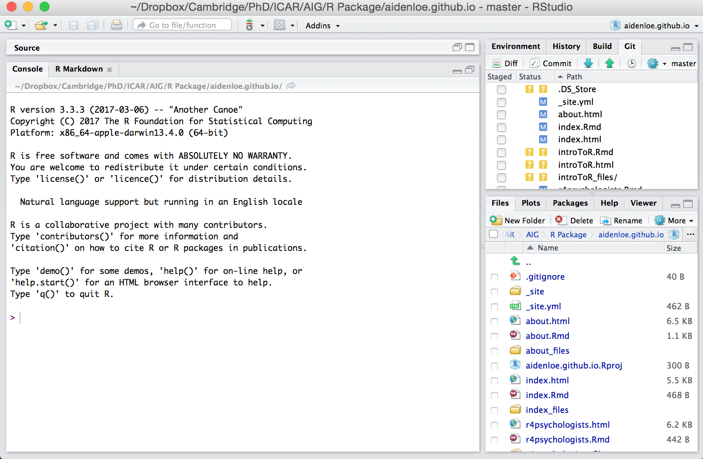
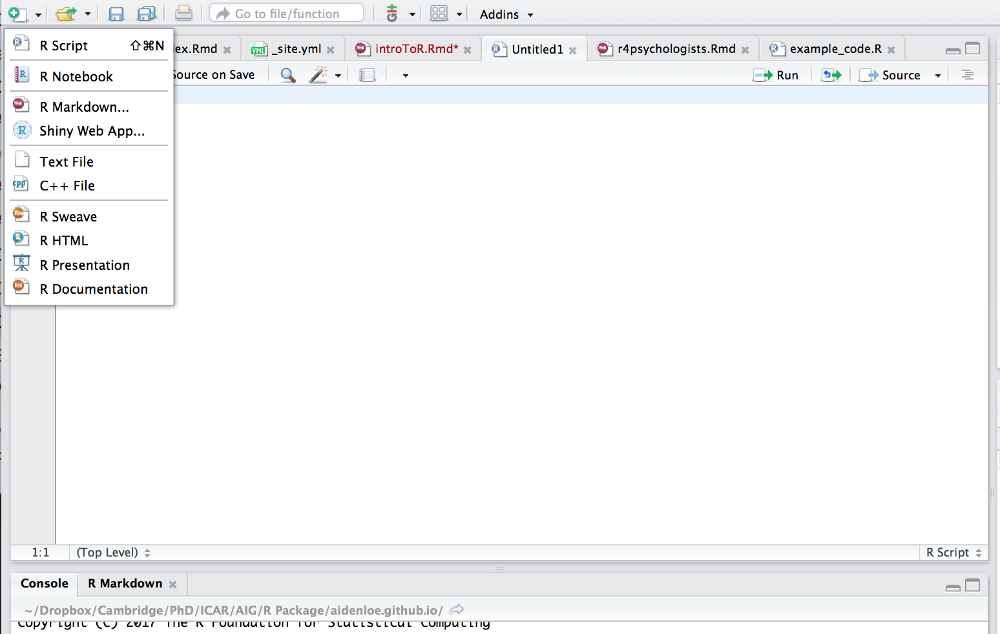

```{r setup, include=FALSE}
knitr::opts_chunk$set(echo = TRUE)
```
## **How to start using R for analysis?**

You got here because you are keen on learning R, so luckily, I don't have to give you reasons to do so. 

Here is the first question. How do you start using R? (Given that you have R and R studio in your computer) 

Think of R as the engine of a car and R studio will be the structure of the car. 

In order to make a car work, you first need the engine. Everything you do will be done in the Car, and not the engine itself. Simiarily, everything you do will be done using R Studio, and R will serve as the engine. 


## **R studio** 

This is how it looks like the first time you open Rstudio.




<br>

## **Script and Console**

The best way to work in R studio is to use a script. 
Click the '+' sign on the top left of R studio and begin using the R Script.



<br>

This is an R script file. It is an easy way to record all the steps you take to clean, manipulate and analyse your data.
Type all your commands here along with detailed comments - comments are extremely helpful for future reference.
You can save, edit and reuse this file as many times as you like. This is also a way of saving your output - you just re-run the code.
Thus, its better to create script files than to directly type in the console (bottom left box in RStudio) which is not editable.

#### Commenting your R script
All code that follows a hash symbol (#) will be ignored by R. i.e. these will be considered comments.
It's best practice to comment your script well so that its easy to come back to even a few months from now, let alone years!


## **Running R scripts**
 1. Select the lines of code that you want to run and press CTRL+ENTER (Mac users COMMAND+ENTER).
 2. Run single lines of code (on which your cursor is) by pressing CTRL+ENTER. The cursor will automatically jump to the next line.
 3. Highlight the lines of code that you want to run and click the 'Run' button on the top right corner of the script file in Rstudio.


```{r simple calculations, results='hide'}
##------------------------------- Simple Calculations  -------------------------

2+2

x=2+2
x

x-3

3*x

x <- 10 #you can also assign values using this arrow. It's exactly the same as using an = sign. I tend to use =
x
x = x * 2
x


```
<br>

##  **R help! functions and JFGI**
  (dont know what 'JFGI' is?? google it!)

 Rstudio's help commands are a boon. Use it shamelessly! 
 
 1. help command - help("FUNCTION_NAME")
 2. OR  ?FUNCTION_NAME
     The help command is very useful when you know some functions but know what they do. 
     RStudio will throw up the related documentation.
 3. ?? command - ??SEARCH
     The ?? command is more generalised and works well if you dont even know whether a specific function exists. 
     You can just search for terms and RStudio will suggest related functions that you can explore.

The help text will appear in the Rstudio window on the bottom right.

 Anything you're trying to achieve has already been attempted by others throughout the world.
 Take advantage of it by google-ing your question.
 There are numerous blogs, forums, tutorials and books with R code that you can just copy/paste and use.

```{r help, results='hide'}
help("install.packages")
?mean
??bind
```


##  **Working Directory**  

 Your "working directory" is the "folder" where R loads and saves data from in this session.

 You can change this location so that its convenient to access your files.

 The 'get working directory' command will show what your working directory is currently set to.

 the easiest way to do it in R Studio is to do it through the menus:

 Go to Session -> Set working directory -> Choose directory...
```{r WD, results='hide'}
getwd() #get current WD
#setwd() set Work Directory e.g. setwd("~/desktop")
```


## **Installing and Loading Packages to extend R**   

You need to install a package only once. 

You will have to do it again if you update R

You will need to load the package each time you start an R session. Two approaches to do this. 

```{r Install and Load, results='hide'}
#install.packages("ggplot2")

library(ggplot2)
#     OR      
require("ggplot2")
```

##  **VARIABLES IN R**  

We store data in R by putting the data into a variable

```{r variables, results='hide'}
object = "data"
object

numbers = 1:10 # 1 to 10
numbers

object = c(3,4,5,2,2,5,3,7,7,8,9)    # c() is a function that means 'combine'
object
```


## **DATA STRUCTURES** 

R has different types of data structures:

  1. Vectors
  2. Matrices
  3. Lists
  4. Data Frames

### Vectors ###
```{r vectors, results='hide'}
vector1 <- c("A", "B", "C")
vector1[3] #refer to the third element in the vector
vector1[1:2] #refer to elements 1 to 2 in the vector
length(vector1) #function to get the total length of the vector
class(vector1) #what variable type is in the vector?


vector2 <- c(5,1,-7,-1,0) 
vector2
class(vector2) 


## R performs mathematical calculations on numeric objects 
vector3<- c(1:5)
vector3
vector3 = vector3 * 2
vector3

# You can also replace a particular element of a vector using square brackets
vector3[3]
vector3[3] <- 106
vector3
```

### Matrix ###
```{r matrix, results='hide'}
# a set of elements that are all the same type, but with rows and columns

sample1 <- matrix(c(1,2,4,4,7,5), nrow=2, byrow = T) #create the matrix
head(sample1) # see first 6 rows
tail(sample1) # see last 6 rows
class(sample1) # see data type

sample1[1,2] #refer to specific elements using square brackets. The first number is the row and the second is the column.
sample1[1,] #if you leave one of them blank, you get the whole row or the whole column. So in this case we have row 1
sample1[,2] #In this case we have column 2


sample2 <- matrix(c(4,7,9,3,7,1,8,2,8,4), ncol=5)
sample2

sample3 <- matrix(c(4,7,9,3,7,1,8,2,8,4), nrow=2)
sample3

# join/bind matrices together
cbind(sample1, sample2) # c = column-wise. So join by column
rbind(sample3, sample2) # r = row-wise. So join by row

# Assign column names
row_matrix <- rbind(sample3, sample2)
colnames(row_matrix) <- c("Maths","English","Physics","Law","Physical Education") #colnames function sets column names
row_matrix
row_matrix[,"Maths"] #so now you can refer by column name

```

### Lists
```{r lists, results='hide'}
# a set of elements that are different data structure put together
friend <- list(name="Jasmine", age = 28)
class(friend) # see data type

friend[["age"]] #Double square brackets to refer to a named list element
friend$name #This also works, but it's less safe than the double brackets method
friend[[2]] #or you can refer to the number of the element
length(friend) #how many elements in the list
```

### Data frame
```{r dataframe, results='hide'}
# similar to a matrix, but different class
# a set of elements that are all the same type, but with rows and columns

family <- data.frame(Names=c('John', 'Jane','Paul','Mary'),
           Age=c('28', '72', '86', '32'),
           Gender=c(0,1,0,1))
head(family) # see first 6 rows
tail(family) # see last 6 rows
class(family) # see data type

family$Names #selecting specific columns by names

```


```{r dataframe, results='hide'}
```
